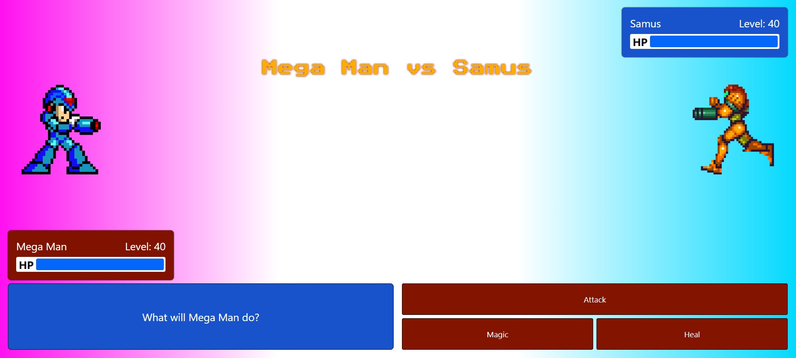

# React Turn Based Game Application

This project is a tutorial delivered by PortExe [YouTube](https://www.youtube.com/watch?v=r7Z7R25spkE). I'm completed this tutorial to expand my knowledge in ReactJS.

## Tutorial / Project Description 

To build a one player turn based AI game using ReactJS only.

**Brief:**
* Build a React game application that allows user to play against an AI Opponent (Samus).
* Build on the basic application to learn more about developing React apps whilst learning about Hooks and state.

## Screenshots

**Desktop Version Only**

## Built with

This application was built using the [Vite](https://vitejs.dev/) development environment and JavaScript.

## Packages Used

In addition to the the frameworks / libraries and tools mentioned above:

* ESLint - used to follow industry standard rules.

## Installation Instructions

* Clone this repo
  * e.g. `gitclone https://github.com/tonymm55/react-megaman.git`
* Change directory into the repo
  * e.g. `cd react-megaman` (or the directory you specified the repo to be cloned into)
* Install the dependencies from `package-lock.json`
  * `npm install`
* To start the app:
  * `npm run dev`

Runs the app in the development mode.\
Open [http://localhost:5173](http://localhost:5173) to view it in your browser.

The page will reload when you make changes.\
You may also see any lint errors in the console.

## If I Had More Time

* I would like to explore why the turns are not always synchronised. My React Hooks knowledge is not quite there yet and so it's an area for developement.

## Author

This project was authored by Anthony Moran. I can be contacted at [LinkedIn](linkedin.com/in/anthonymmoran) and [Twitter](https://twitter.com/TonyMCodes).
